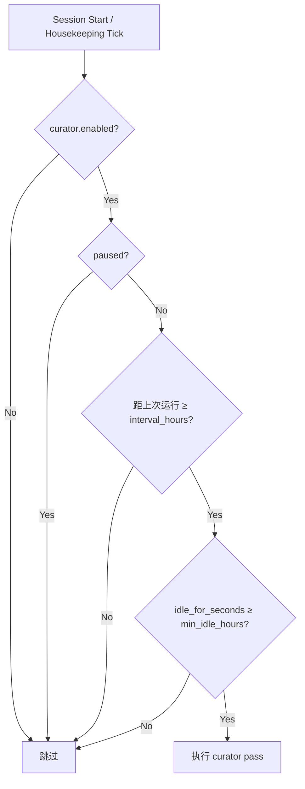
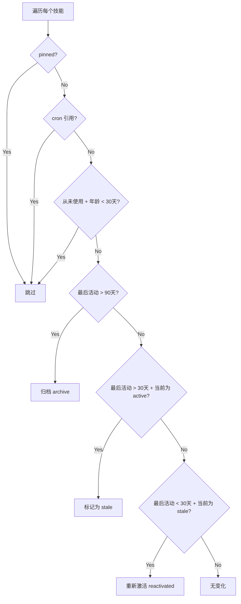

# Curator —— 后台技能维护编排器

> 文件位置：`agent/curator.py`（约 2017 行）
> 分析日期：2026-07-20（更新：工具机制、模型解析、归档分类体系）

---

## 一、模块定位

Curator 是 Hermes 的**后台技能自动维护系统**。它在 Agent 空闲时定期审查 agent 自己创建的技能，对技能做状态管理（active → stale → archived）和合并归纳（umbrella-building），保持技能库的整洁和可发现性。

一句话概括：**自动管家，定期打扫技能库，不删东西只归档，默认不花钱。**

---

## 二、核心设计原则

### 2.1 四条硬约束（Strict Invariants）

| # | 规则 | 含义 |
|---|------|------|
| 1 | 只管理 agent 创建和内置的技能 | 通过 `tools/skill_usage.is_agent_created` 判断，用户手工创建的技能不受影响 |
| 2 | 绝不自动删除，最多归档 | 归档到 `~/.hermes/skills/.archive/`，可恢复，不是真删除 |
| 3 | 置顶（pinned）技能不被自动处理 | 用户可以 `hermes curator pin <name>` 保护重要技能 |
| 4 | 使用 auxiliary client | 独立模型通道，不影响主会话的 prompt cache |

### 2.2 触发机制

**非 cron 定时任务，而是基于空闲触发（inactivity-triggered）：**



默认参数：
- `interval_hours` = `24 * 7`（**7 天**）
- `min_idle_hours` = `2`（**闲置 2 小时**，但目前 CLI 和 Gateway 都传 `float("inf")`，实际上绕过了这个检查）
- `stale_after_days` = `30`（30 天无活动标记为 stale）
- `archive_after_days` = `90`（90 天无活动归档）

---

## 三、入口方法

### 3.1 公共入口：`maybe_run_curator()` — 第 1998 行

```python
def maybe_run_curator(
    *,
    idle_for_seconds: Optional[float] = None,
    on_summary: Optional[Callable[[str], None]] = None,
) -> Optional[Dict[str, Any]]:
```

**调用方（目前两个）：**

| 位置 | 场景 | idle 传值 |
|------|------|-----------|
| `cli.py:13276` | CLI 启动时 | `float("inf")` — 启动即空闲 |
| `gateway/run.py:20496` | Gateway housekeeping 轮询 | `float("inf")` — 永远满足 |

职责：门控检查 → 调 `run_curator_review()`。失败只打 debug 日志，不抛异常。

### 3.2 执行入口：`run_curator_review()` — 第 1494 行

```python
def run_curator_review(
    on_summary: Optional[Callable[[str], None]] = None,
    synchronous: bool = False,
    dry_run: bool = False,
    consolidate: Optional[bool] = None,
) -> Dict[str, Any]:
```

被 `maybe_run_curator()` 自动调用，也被 CLI 命令 `hermes curator run` 直接调用。

---

## 四、执行流程

### 4.1 四步流程

| 步骤 | 内容 | 涉及 LLM？ |
|------|------|------------|
| 1 | **确定性状态转换**（`apply_automatic_transitions`） | 否 |
| 2 | **LLM 审查**（仅在 `consolidate=True` 时） | 是，花 aux-model 的钱 |
| 3 | **更新 `.curator_state`** | 否 |
| 4 | **回调 `on_summary`**，通知外部 | 否 |

### 4.2 第一步：确定性状态转换（第 305 行 `apply_automatic_transitions`）

纯 Python 逻辑，不涉及 LLM，**不花钱**。遍历所有被管理技能，逐条比较最后活动时间：



### 4.3 第二步：LLM 审查（`_llm_pass()`，第 1583 行）

**这是 curator 的真正核心**，在 `run_curator_review()` 内部定义为闭包函数 `_llm_pass()`。

#### 分支逻辑：

```
consolidate = False（默认）              consolidate = True（用户显式开启）
───────────────────────                 ────────────────────────────
只做第一步的确定性 prune                  ↑ 第一步的 prune 照做
跳过 LLM，不花钱                          ↓ 然后进入 LLM 流程：
写报告 → 结束                             1. _render_candidate_list()
                                          2. 组装 prompt（CURATOR_REVIEW_PROMPT）
                                          3. _run_llm_review(prompt)
                                             → spawn AIAgent fork
                                             → LLM 调用 skill_manage/terminal
                                          4. _classify_removed_skills()
                                          5. _reconcile_classification()
                                          6. _build_rename_summary()
                                          7. _write_run_report()
                                          8. save_state()
                                          9. on_summary()
```

#### consolidate 参数决策链（第 1528 行）：

```python
if consolidate is None:
    consolidate = get_consolidate()  # 读配置 curator.consolidate（默认 False）
```

| 场景 | consolidate 值 | 效果 |
|------|---------------|------|
| `maybe_run_curator()` 不传 | `None` → `False`（读配置） | 只 prune，不花 LLM 钱 |
| `hermes curator run --consolidate` | `True`（强制） | 完整 LLM review |
| 配置设 `curator.consolidate: true` | `None` → `True`（读配置） | 默认也跑 LLM |

### 4.4 LLM 审查的 Prompt 策略

`CURATOR_REVIEW_PROMPT`（第 417 行）是一段约 150 行的详细指令，核心思路是 **Umbrella Building**：

- **目标**：把几百个窄技能（每个只记录一次 session 的特定 bug）合并成几十个**类级别**（class-level）的大技能
- **方法**：识别前缀集群（如 `hermes-config-*`、`mcp-*`、`python-*`），每个集群创建一个 umbrella 技能，把子技能的内容吸收为其 `references/`、`templates/`、`scripts/` 子文件
- **约束**：不删技能、不碰 pinned、不碰 hub-installed、不碰外部目录技能

#### PRUNE-BUILTINS 模式（第 1658-1668 行）

当用户开启 `curator.prune_builtins: true` 时，动态追加一段提示词：

> "内置技能也在候选列表里了，可以像对待 agent 创建的技能一样归档它们。但只能归档不能删除，且 `hermes update` 不会自动恢复。"

覆盖了主 prompt 中规则 #1 对 bundled skills 的限制。

#### Prompt 拼接位置

`CURATOR_REVIEW_PROMPT` 在 `_llm_pass()` 内被拼接到最终 prompt 中（第 1669-1676 行），有两种组装方式：

| 模式 | 组装公式 | 用途 |
|------|----------|------|
| dry_run | `DRY_RUN_BANNER + CURATOR_REVIEW_PROMPT + builtins_note + candidate_list` | 前面插入 "只读不写" 的 banner |
| 正式运行 | `CURATOR_REVIEW_PROMPT + builtins_note + candidate_list` | 无 banner，LLM 可执行变更 |

拼接后的 prompt 作为 `user_message` 传给 `_run_llm_review()`，成为审查 LLM 收到的第一条消息。

### 4.5 `_run_llm_review()` 详解 — 第 1825 行

这是真正 spawn AIAgent fork 执行 LLM 审查的函数。从不抛异常，失败返回结构化错误。

#### 4.5.1 模型解析：三级回退

`_resolve_review_runtime()`（第 1758 行）决定 curator fork 用什么模型：

```
优先级1: auxiliary.curator.{provider,model}     ← 标准的 aux task slot，通过 hermes model 配置
    ↓ 没配或 provider="auto"
优先级2: curator.auxiliary.{provider,model}      ← 旧版配置路径（已废弃，打 warning）
    ↓ 也没配
优先级3: model.{provider,default}                ← 兜底：直接用主聊天模型
```

此外，`resolve_runtime_provider()` 还会处理凭证解析（API key、base URL、credential pool、ACP command 等），确保即使 curator 用不同 provider 也能正确认证。

#### 4.5.2 AIAgent 实例化参数

```python
review_agent = AIAgent(
    model=_model_name,
    provider=_resolved_provider,
    api_key=_api_key,
    base_url=_base_url,
    api_mode=_api_mode,
    credential_pool=_credential_pool,
    request_overrides=_request_overrides,
    max_iterations=9999,          # 高上限，因为可能遍历几百个技能
    quiet_mode=True,              # 静默，不污染前台终端
    platform="curator",           # 标记为 curator 平台
    skip_context_files=True,      # 不注入项目上下文
    skip_memory=True,             # 不初始化记忆系统
)
```

#### 4.5.3 关键后处理

创建 AIAgent 后立即做三件事：

```python
review_agent._memory_nudge_interval = 0   # 禁用记忆自动 nudge
review_agent._skill_nudge_interval = 0    # 禁用技能自动 nudge
review_agent._memory_write_origin = "background_review"  # 标记写入来源
```

`_memory_write_origin = "background_review"` 尤为关键：`skill_manage` 的写保护会根据这个值判断是否允许修改 bundled/hub-installed 技能——curator fork 只有标了这个值，`is_background_review()` 才返回 `True`，写保护才会放行。

#### 4.5.4 运行与输出重定向

```python
with open(os.devnull, "w") as _devnull, \
     contextlib.redirect_stdout(_devnull), \
     contextlib.redirect_stderr(_devnull):
    conv_result = review_agent.run_conversation(user_message=prompt)
```

stdout/stderr 重定向到 `/dev/null`，防止工具调用过程中的输出污染终端。

#### 4.5.5 工具调用收集

审查完成后，从 `review_agent._session_messages` 中提取所有 tool call，截断超过 400 字符的参数，写入 `result_meta["tool_calls"]`，供后续分类和报告使用。

### 4.6 工具传递机制：为什么 curator 没显式传 tools？

`_run_llm_review()` 创建 AIAgent 时没有传 `enabled_toolsets` / `disabled_toolsets`，也没有传任何工具定义。工具从哪来？

#### 自动加载机制

AIAgent 初始化时（`agent/agent_init.py:1189`）：

```python
agent.tools = registry.get_tool_definitions(
    enabled_toolsets=enabled_toolsets,   # None → 不过滤
    disabled_toolsets=disabled_toolsets,  # None → 不过滤
)
```

不传参数 → `None` → **加载全部已注册工具**（包括 `skill_manage`、`skills_list`、`skill_view`、`terminal`，以及 `execute_code`、`browser` 等所有其他工具）。

#### 双通道设计

LLM 最终收到的工具信息来自两个通道：

| 通道 | 形式 | 作用 |
|------|------|------|
| **原生 tool schema** | API `tools=` 字段，`{"type":"function","function":{name,description,parameters}}` | 精确的工具定义（参数类型、必填项、描述） |
| **Prompt 中的 `"Your toolset:"`** | 系统消息文本 | curator 任务特定的使用策略（怎么组合工具、传什么参数） |

两者是**互补关系**：原生 schema 是"字典"（能调什么），prompt 是"战术"（在这个任务里怎么用）。例如 `skill_manage` 的 schema 描述是通用的"管理技能"，prompt 补充了"归档时记得传 `absorbed_into=<umbrella>`"——这是 curator 独有的操作规范，原生 schema 不会写。

#### 软约束 vs 硬过滤

curator 的 LLM 理论上能调用所有工具，但靠两层约束保持行为正确：

1. **Prompt 软约束**：`"Your toolset:"` 明确列出允许使用的工具 + 具体用法
2. **运行时禁用**：`_memory_nudge_interval = 0` / `_skill_nudge_interval = 0` 关掉自动 nudge，`skip_memory=True` 不初始化记忆后端

设计思路：**工具全集加载（简单），靠 prompt 约束行为（灵活），禁掉自动干扰（安静）**。curator 是低频任务，没必要为它建一套工具白名单过滤。

### 4.7 归档分类体系：三信号融合 — 第 615-1000 行

curator 最精妙的设计之一：一个技能被归档了，如何判断它是"被合并到 umbrella"还是"单纯过期清理"？三种信息来源，按权威性从高到低融合。

#### 三个信号源

| 优先级 | 信号 | 来源 | 函数 |
|--------|------|------|------|
| 🔴 最高 | `absorbed_into` 声明 | LLM 调用 `skill_manage(action='delete')` 时**当场声明** `absorbed_into=<umbrella>` 或 `absorbed_into=""` | `_extract_absorbed_into_declarations()` |
| 🟡 中等 | 结构化 YAML 块 | LLM 最终回复里 `## Structured summary` 下的 `consolidations:` / `prunings:` | `_parse_structured_summary()` |
| 🟢 最低 | 工具调用启发式 | 纯代码分析：LLM 有没有在删除 X 的同时往 Y 写文件 / patch？ | `_classify_removed_skills()` |

#### 融合策略（`_reconcile_classification()`，第 872 行）

```
对于每个被删除的技能：
  1. 有 absorbed_into 声明？
     ├── into="" → 明确 prune ✅
     ├── into="Y" 且 Y 存在 → 明确 consolidation ✅
     └── into="Y" 但 Y 不存在 → LLM 幻觉，降级 ↓
  
  2. LLM 的 YAML 说合并到 Y？
     ├── Y 存在 → consolidation ✅
     └── Y 不存在 → 幻觉，看启发式
  
  3. 启发式发现工具调用证据？
     ├── 有 → consolidation（标记 source="tool-call audit"）
     └── 无 → pruned（标记 source="no-evidence fallback"）
```

#### 为什么 `absorbed_into` 优先级最高？

因为这是 LLM **在操作发生的瞬间**自己声明的意图——"我现在删除 X，它的内容被 Y 吸收了"。比事后写的 YAML 摘要更可靠，也比纯代码分析更有语义理解。

如果 LLM 声明的 `absorbed_into` 目标不存在（幻觉），则降级处理——优先用启发式的发现，否则归为 pruned。

---

## 五、状态管理

### 5.1 技能生命周期

```
active ──(30天无活动)──▶ stale ──(90天无活动)──▶ archived
  ▲                          │                        │
  │                          │                        │
  └────(有活动，自动恢复)─────┘                        │
                                                      │
                              可恢复 ◀── hermes curator restore <name>
```

### 5.2 `.curator_state` 文件

路径：`~/.hermes/skills/.curator_state`

```json
{
  "last_run_at": "2026-07-19T10:30:00+00:00",
  "last_run_duration_seconds": 45.2,
  "last_run_summary": "auto: 3 marked stale, 1 archived; llm: skipped (consolidation off)",
  "last_run_summary_shown_at": null,
  "last_report_path": "/Users/.../logs/curator/20260719-103000",
  "paused": false,
  "run_count": 12
}
```

### 5.3 报告文件

每次运行产生：`logs/curator/{YYYYMMDD-HHMMSS}/`
- `run.json` — 机器可读的完整数据
- `REPORT.md` — 人类可读的审查报告
- `cron_rewrites.json` — 仅在 cron 引用被改写时产生

---

## 六、关键设计决策

### 6.1 为什么在 LLM 之前就持久化状态？（第 1570 行注释）

> "Persist state before the LLM pass so a crash mid-review still records the run and doesn't immediately re-trigger."

LLM 审查可能跑很久（50-100 次 API 调用）。如果在 LLM 中途崩溃，状态文件已记录 `last_run_at`，下次检查发现距上次运行还不够 7 天，**不会立刻重新触发**，避免崩溃循环。

### 6.2 dry-run 为什么不 bump 时间戳？（第 1571 行注释）

> "dry run shouldn't push the next scheduled real pass out."

dry-run 是试运行，只出报告不做真实变更。如果试运行也更新 `last_run_at`，真正的定时审查会被推迟整整 7 天。

### 6.3 快照失败为什么阻止 curator？（第 1544 行注释）

> "A failed snapshot logs at debug and continues — the alternative is that a transient disk issue silently disables curator forever, which is worse."

快照（`curator_backup.snapshot_skills`）是 curator 的安全网，但不是 curator 的前置条件。一次磁盘瞬断如果导致 curator 永久静默停摆，比丢失一次回滚保险更糟。

### 6.4 为什么用线程而不是 asyncio？（第 1748 行）

```python
t = threading.Thread(target=_llm_pass, daemon=True, name="curator-review")
t.start()
```

- `AIAgent.run_conversation()` 是**同步阻塞**的，底层 HTTP 调用链全同步
- 改造成 async 需要重构 `AIAgent` → HTTP 客户端整条链路，影响面巨大，收益小
- curator 是低频任务（7 天一次、一次一个 LLM 审查），守护线程完全够用
- Hermes 核心 agent 循环本身就是同步的 `while` 循环，不是为了高并发设计的

实际上 Hermes 项目在**该用 async 的地方也用了 async**（Gateway 的 Discord/Slack 接入、aiohttp 代理、LSP client），只是核心 agent 不需要而已。

---

## 七、返回值

### 7.1 `run_curator_review()` 返回值

```python
{
    "started_at": "2026-07-19T10:30:00+00:00",   # 启动时间（ISO 8601）
    "auto_transitions": {                          # 确定性阶段计数
        "checked": 42,
        "marked_stale": 3,
        "archived": 1,
        "reactivated": 0,
        "seeded": 0
    },
    "summary_so_far": "3 marked stale, 1 archived"  # 确定性阶段摘要
}
```

**注意**：因为默认异步（`synchronous=False`），返回时 LLM 审查还没执行完。这三个值只反映第一步（确定性 prune）。LLM 完成后的结果通过 `on_summary` 回调和状态文件传递。

### 7.2 `on_summary` 回调

```python
on_summary: Optional[Callable[[str], None]] = None
```

外部传入的回调函数，curator 在关键节点调用它推送摘要消息：

| 触发时机 | 消息示例 |
|----------|----------|
| 运行前创建了快照 | `"curator: snapshot created (pre-curator-run-xxx)"` |
| consolidation 关闭，仅 prune | `"curator: auto: 3 marked stale; llm: skipped (consolidation off)"` |
| LLM 审查完成 | `"curator: auto: no changes; llm: 12 consolidated, 3 pruned\narchived 15 skill(s):\n  • pdf-extraction → document-tools\n  …"` |

---

## 八、关键函数索引

| 函数 | 行号 | 用途 |
|------|------|------|
| `load_state()` | 101 | 读取 `.curator_state` 文件 |
| `save_state()` | 116 | 写入 `.curator_state` 文件 |
| `is_enabled()` | 154 | 检查 `curator.enabled` 配置 |
| `is_paused()` | 130 | 检查是否暂停 |
| `get_interval_hours()` | 160 | 默认 168（7天） |
| `get_min_idle_hours()` | 168 | 默认 2 小时 |
| `get_stale_after_days()` | 176 | 默认 30 天 |
| `get_archive_after_days()` | 184 | 默认 90 天 |
| `get_consolidate()` | 204 | 默认 False |
| `get_prune_builtins()` | 192 | 是否允许清理内置技能 |
| `should_run_now()` | 233 | 门控：是否该运行了 |
| `apply_automatic_transitions()` | 305 | 第一步：确定性状态转换 |
| `run_curator_review()` | 1494 | 执行一次 curator 审查 |
| `_llm_pass()` | 1583 | 核心：LLM 审查闭包 |
| `_render_candidate_list()` | 1472 | 格式化候选技能清单 |
| `_run_llm_review()` | 1825 | spawn AIAgent fork（模型解析 + 实例化） |
| `_resolve_review_runtime()` | 1758 | 三级回退解析模型和凭证 |
| `_resolve_review_model()` | 1806 | 解析 (provider, model) 元组 |
| `_write_run_report()` | 1093 | 写 run.json + REPORT.md |
| `_render_report_markdown()` | 1285 | 渲染人类可读的 REPORT.md |
| `_classify_removed_skills()` | 615 | 启发式分析：工具调用中找合并证据 |
| `_reconcile_classification()` | 872 | 三信号融合：absorbed_into + YAML + 启发式 |
| `_build_rename_summary()` | 1003 | 生成 `old → umbrella` 映射 |
| `_parse_structured_summary()` | 737 | 解析 LLM 返回的 YAML 块 |
| `_extract_absorbed_into_declarations()` | 818 | 从工具调用提取 `absorbed_into` 声明 |
| `maybe_run_curator()` | 1998 | 公共入口 + 门控 |

---

## 九、配置参考

```yaml
# ~/.hermes/config.yaml
curator:
  enabled: true              # 是否启用（默认 true）
  interval_hours: 168        # 运行间隔（默认 7 天）
  min_idle_hours: 2          # 最小空闲时长
  stale_after_days: 30       # 多久无活动标 stale
  archive_after_days: 90     # 多久无活动归档
  consolidate: false         # 是否开启 LLM umbrella-building（默认关）
  prune_builtins: true       # 是否允许清理内置技能（默认 true）
```

CLI 命令：
- `hermes curator status` — 查看 curator 状态和上次报告
- `hermes curator run --dry-run` — 试运行，只看报告不执行
- `hermes curator run --consolidate` — 强制执行含 LLM 的完整审查
- `hermes curator pin <name>` — 置顶技能，curator 不再动它
- `hermes curator restore <name>` — 从归档恢复技能
- `hermes curator pause` / `hermes curator resume` — 暂停/恢复

---

## 十、待补充

> 已覆盖：工具传递机制（4.6）、模型解析（4.5）、归档分类融合（4.7）、prompt 拼接（4.4）、AIAgent 实例化细节（4.5）
>
> 后续如需补充的内容：
>
> - [ ] 技能归档后的恢复机制细节（`hermes curator restore`）
> - [ ] `skill_usage` 模块的完整 API（`agent_created_report`、`archive_skill`、`set_state` 等）
> - [ ] `curator_backup` 快照机制（`snapshot_skills` 的完整流程）
> - [ ] cron 引用改写（`rewrite_skill_refs`）的完整流程
> - [ ] `_run_llm_review()` 中 `resolve_runtime_provider` 的完整凭证解析链
> - [ ] curator 端到端测试用例解读（`tests/agent/test_curator.py`）
