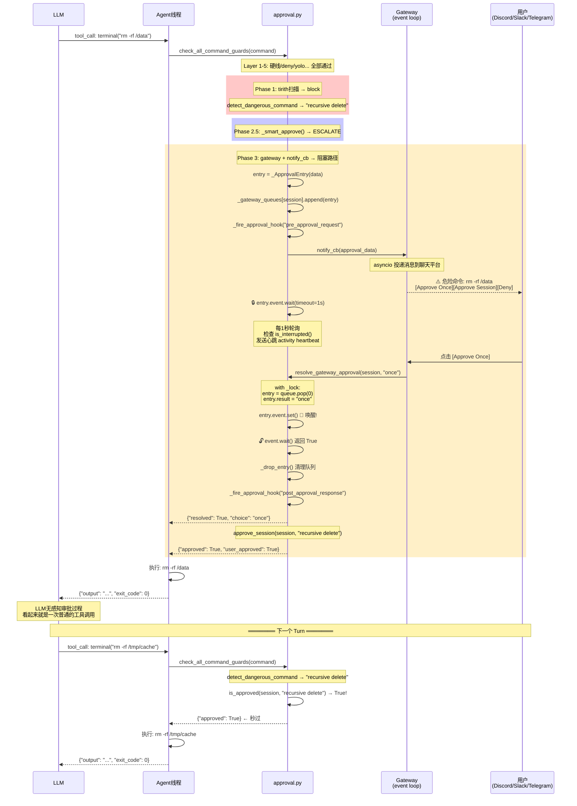

# 危险命令审批流程 — 检测 → 阻塞 → 审批 → 恢复

> 源码: `tools/approval.py` (3391行) + `model_tools.py` + `terminal_tool.py` + `gateway/slash_commands.py`

---

## 零、总览流程图

```mermaid
flowchart TD
    A["LLM 产生 tool_call<br/>terminal(command='rm -rf /data')"] --> B["run_agent.py<br/>_execute_tool_calls()"]
    B --> C["model_tools.py<br/>handle_function_call('terminal', args)"]
    C --> D["terminal_tool.py<br/>_handle_terminal()"]

    D --> E{"force=True?<br/>(用户已预审批)"}
    E -->|Yes| EXEC["执行命令"]
    E -->|No| F["check_all_command_guards<br/>(command, env_type)"]

    F --> G{"隔离容器?<br/>(singularity/modal/<br/>docker无host)"}
    G -->|Yes| APPROVED["✅ approved"]

    G -->|No| H{"🔴 HARDLINE<br/>rm -rf /, mkfs,<br/>dd to /dev/sda,<br/>shutdown, fork bomb?"}
    H -->|匹配| BLOCKED_HARD["❌ BLOCKED<br/>无条件封锁<br/>yolo也无法绕过"]

    H -->|通过| I{"🔴 sudo -S<br/>且无SUDO_PASSWORD?"}
    I -->|匹配| BLOCKED_SUDO["❌ BLOCKED<br/>sudo密码爆破"]

    I -->|通过| J{"🔴 approvals.deny<br/>glob匹配?"}
    J -->|匹配| BLOCKED_DENY["❌ BLOCKED<br/>用户自定义否决"]

    J -->|通过| K{"🟢 yolo / mode=off?"}
    K -->|Yes| APPROVED

    K -->|No| L{"🟢 command_allowlist<br/>glob匹配?"}
    L -->|匹配| APPROVED

    L -->|不匹配| M["Phase 1: 收集发现"]

    M --> N["tirith 内容安全扫描"]
    M --> O["detect_dangerous_command()"]

    N --> P{"有发现?"}
    O --> Q{"有发现?"}
    P -->|Yes| WARNINGS["warnings += tirith"]
    P -->|No| WARNINGS
    Q -->|Yes| WARNINGS2["warnings += dangerous"]
    Q -->|No| WARNINGS2

    WARNINGS --> WARNINGS2
    WARNINGS2 --> R{"warnings为空?"}
    R -->|Yes| APPROVED

    R -->|No| S{"approvals.mode<br/>== 'smart'?"}
    S -->|Yes| SMART["_smart_approve()<br/>辅助LLM评估"]
    SMART -->|APPROVE| APPROVED_ONCE["✅ approved<br/>(仅当次,不持久化)"]
    SMART -->|DENY + 非交互| BLOCKED_SMART["❌ BLOCKED"]
    SMART -->|DENY/ESCALATE| PHASE3

    S -->|No| PHASE3["Phase 3: 人机审批"]
    PHASE3 --> CTX{"当前上下文?"}

    CTX -->|"Gateway<br/>+ notify_cb"| GW_BLOCK["🔒 Gateway阻塞路径<br/>_await_gateway_decision()"]

    GW_BLOCK --> GW_Q1["1. 创建 _ApprovalEntry<br/>&nbsp;&nbsp;&nbsp;entry.event = threading.Event()"]
    GW_Q1 --> GW_Q2["2. 入队<br/>&nbsp;&nbsp;&nbsp;_gateway_queues[session].append(entry)"]
    GW_Q2 --> GW_Q3["3. notify_cb(approval_data)<br/>&nbsp;&nbsp;&nbsp;→ Discord/Slack/Telegram 消息+按钮"]
    GW_Q3 --> GW_Q4["4. 🔒 while True:<br/>&nbsp;&nbsp;&nbsp;entry.event.wait(timeout=1s)"]

    GW_Q4 --> GW_POLL{"每1秒检查"}
    GW_POLL -->|"is_interrupted()<br/>(/stop)"| GW_INTR["entry.result='deny'<br/>entry.event.set()<br/>(自我唤醒)"]
    GW_POLL -->|"timeout (60s)"| GW_TO["resolved=False<br/>(静默≠同意)"]
    GW_POLL -->|"entry.event.set()<br/>(用户已审批)"| GW_WAKE["🔓 resolved=True<br/>choice='once'/'session'/'always'"]
    GW_POLL -->|"未触发"| GW_HB["touch_activity_if_due()<br/>(心跳防watchdog误杀)"]

    GW_HB --> GW_POLL
    GW_INTR --> GW_CLEANUP["_drop_entry()<br/>清理队列"]
    GW_TO --> GW_CLEANUP
    GW_WAKE --> GW_CLEANUP

    GW_CLEANUP --> GW_RESULT{"结果?"}
    GW_RESULT -->|"deny/timeout"| BLOCKED_USER["❌ BLOCKED<br/>用户拒绝/超时"]
    GW_RESULT -->|"once/session/always"| PERSIST["持久化:<br/>approve_session(key)<br/>approve_permanent(key)"]
    PERSIST --> APPROVED_USER["✅ approved<br/>user_approved=True"]

    CTX -->|"Gateway<br/>无 notify_cb"| GW_NB["非阻塞路径<br/>submit_pending()"]
    GW_NB --> PENDING["⏳ return {status:'pending_approval'}<br/>terminal_tool 直接返回给 LLM<br/>LLM 稍后重试 → is_approved()秒过"]

    CTX -->|"CLI 交互"| CLI_BLOCK["🔒 CLI阻塞路径<br/>prompt_dangerous_approval()"]
    CLI_BLOCK --> CLI_INPUT["input('[o]nce/[s]ession/[a]lways/[d]eny')<br/>线程阻塞等待 stdin"]
    CLI_INPUT --> CLI_RESULT{"用户选择?"}
    CLI_RESULT -->|"deny"| BLOCKED_USER
    CLI_RESULT -->|"once/session/always"| PERSIST

    CTX -->|"非交互 非gateway<br/>(cron/batch)"| CRON{"cron + deny模式?"}
    CRON -->|Yes| BLOCKED_CRON["❌ BLOCKED<br/>无用户可审批"]
    CRON -->|No| APPROVED

    APPROVED --> EXEC
    APPROVED_ONCE --> EXEC
    APPROVED_USER --> EXEC

    EXEC --> RETURN["返回命令输出给 LLM<br/>(LLM无感知审批过程)"]

    BLOCKED_HARD --> RETURN_ERR["返回 BLOCKED 错误给 LLM"]
    BLOCKED_SUDO --> RETURN_ERR
    BLOCKED_DENY --> RETURN_ERR
    BLOCKED_SMART --> RETURN_ERR
    BLOCKED_USER --> RETURN_ERR
    BLOCKED_CRON --> RETURN_ERR
    PENDING --> RETURN_PENDING["返回 pending_approval 给 LLM"]

    style BLOCKED_HARD fill:#ff4444,color:#fff
    style BLOCKED_SUDO fill:#ff4444,color:#fff
    style BLOCKED_DENY fill:#ff4444,color:#fff
    style BLOCKED_SMART fill:#ff4444,color:#fff
    style BLOCKED_USER fill:#ff4444,color:#fff
    style BLOCKED_CRON fill:#ff4444,color:#fff
    style APPROVED fill:#44aa44,color:#fff
    style APPROVED_ONCE fill:#44aa44,color:#fff
    style APPROVED_USER fill:#44aa44,color:#fff
    style GW_Q4 fill:#ffaa00,color:#000
    style CLI_INPUT fill:#ffaa00,color:#000
    style PENDING fill:#ffaa00,color:#000
```



### 跨线程时序图



---

## 一、审批系统的分层架构

```
terminal_tool.py   ← 真正执行命令的工具，调用前先过审批门
       │
       ▼
approval.py:check_all_command_guards()   ← 总编排入口
       │
       ├─ Layer 0: 隔离容器跳过
       ├─ Layer 1: detect_hardline_command()    ← 无条件封锁（yolo也无法绕过）
       ├─ Layer 2: _check_sudo_stdin_guard()    ← sudo密码爆破防御
       ├─ Layer 3: _match_user_deny_rule()      ← 用户自定义deny glob
       ├─ Layer 4: is_approval_bypass_active()  ← yolo / mode=off 旁路
       ├─ Layer 5: _command_matches_permanent_allowlist() ← 永久允许列表
       │
       ├─ Phase 1: 收集发现
       │   ├─ tirith 内容安全扫描（语义级威胁: homograph URL, 管道注入...）
       │   └─ detect_dangerous_command()（模式级威胁: rm -rf, chmod 777...）
       │
       ├─ Phase 2.5: 智能审批（mode=smart时）
       │   └─ _smart_approve() → 辅助LLM评估 → approve/deny/escalate
       │
       └─ Phase 3: 人机审批
           ├─ CLI路径: prompt_dangerous_approval() → input() 阻塞
           ├─ Gateway阻塞路径: _await_gateway_decision() → threading.Event 阻塞
           └─ Gateway非阻塞路径: submit_pending() → agent稍后重试
```

---

## 二、核心数据结构

### 2.1 `_ApprovalEntry` — 单个审批请求

```python
# approval.py:1492-1503
class _ApprovalEntry:
    __slots__ = ("event", "data", "result", "reason")
    
    def __init__(self, data: dict):
        self.event = threading.Event()    # ← 跨线程同步原语
        self.data = data                  # command, description, pattern_keys...
        self.result: Optional[str] = None # "once"|"session"|"always"|"deny"
        self.reason: Optional[str] = None # /deny <reason> 的拒绝原因
```

### 2.2 模块级队列和通知表

```python
# approval.py:1506-1507
_gateway_queues: dict[str, list] = {}      # session_key → [_ApprovalEntry, …]
_gateway_notify_cbs: dict[str, object] = {} # session_key → callable(approval_data)
```

### 2.3 审批状态存储（4级粒度）

```python
_lock = threading.Lock()
_pending: dict[str, dict] = {}           # session_key → 最近一条 pending 审批
_session_approved: dict[str, set] = {}   # session_key → {pattern_key, ...}
_session_yolo: set[str] = set()          # 已设置 /yolo 的 session
_permanent_approved: set = set()         # 全局永久批准的模式
```

---

## 三、检测层：三层防线

### 3.1 Hardline（硬线封锁）— 无条件拦截

`detect_hardline_command()` [approval.py:500](tools/approval.py#L500)

**特点**: 即使 `--yolo`、`/yolo`、`approvals.mode: off` 也无法绕过。

匹配的命令类别:
- `rm -rf /` 和各种 root 覆写变形（`/ // /. /.. /./ /../ /*`）
- `rm -rf /home`, `/etc`, `/usr`, `/var`, `/bin`... 系统目录
- `rm -rf ~` / `rm -rf $HOME` 家目录覆写
- `mkfs` 格式化文件系统
- `dd of=/dev/sd*` 裸设备覆写，`> /dev/sd*` 重定向到裸设备
- `:(){ :|:& };:` fork bomb
- `kill -1` 杀全部进程
- `shutdown/reboot/halt/poweroff/init 0/6/systemctl poweroff/telinit 0`

**关键实现**: `_CMDPOS` 锚点防止误杀普通文本:

```python
# approval.py:365-372
_CMDPOS = (
    r'(?:^|[;&|\n`]|\$\()'         # start position
    r'\s*'
    r'(?:sudo\s+(?:-[^\s]+\s+)*)?'  # optional sudo
    r'(?:env\s+(?:\w+=\S*\s+)*)?'   # optional env
    r'(?:(?:exec|nohup|setsid|time)\s+)*'
    r'\s*'
)
```

`rm -rf "/"` + `rm -rf "$HOME"` 这类引号包裹的路径用 `_hardline_rm_path()` 特殊处理，避免引号破坏正则锚点。

### 3.2 Sudo stdin 密码爆破防御

`_check_sudo_stdin_guard()` [approval.py:481](tools/approval.py#L481)

当 `SUDO_PASSWORD` 环境变量未设置时，任何显式的 `sudo -S` 都是 LLM 在尝试管道输入猜测密码，无条件拦截。

### 3.3 用户自定义 deny 规则

`_match_user_deny_rule()` [approval.py:514](tools/approval.py#L514)

`approvals.deny` 在 config.yaml 中配置的 fnmatch glob 列表，命中后即使 yolo 也会拦截。

### 3.4 危险模式检测

`detect_dangerous_command()` [approval.py:1455](tools/approval.py#L1455)

47 个危险模式，覆盖:
- 删除操作: `rm -rf`, `rm --recursive`, `find -exec rm`, `find -delete`, `xargs rm`
- 权限提升: `chmod 777/666`, `chown -R root`
- 磁盘操作: `mkfs`, `dd if=`
- SQL 破坏: `DROP TABLE`, `DELETE FROM` 无 WHERE, `TRUNCATE`
- 系统服务: `systemctl stop/restart/disable`
- 进程杀灭: `kill -9 -1`, `pkill -9`, `killall -KILL`, `killall -r`
- 远程代码执行: `curl|bash`, `wget|sh`, `$(curl ...)`, `eval $(...)`, `source <(curl ...)`
- 代码混淆: `base64 -d|bash`, `xxd -r|bash`, `echo|tr|bash`, `openssl -d|bash`
- 脚本执行: `bash -c`, `python -e/-c`, heredoc 执行, `chmod +x` + 立即执行
- 文件篡改: `tee/cp/mv/install` 到敏感路径, `sed -i` 到系统配置/SSH/RC 文件
- Git 破坏: `git reset --hard`, `git push --force`, `git clean -f`, `git branch -D`
- 容器生命周期: `docker compose restart/stop/kill/down`
- 网关自毁: `hermes gateway stop/restart`, `pkill hermes`
- sudo 特权: `sudo -S/-A/-s` 等特权标志

### 3.5 命令标准化防御混淆

`_normalize_command_for_detection()` [approval.py:843](tools/approval.py#L843)

防御以下绕过手法的逐层剥离:
1. ANSI 转义序列 (`\x1b[...`)
2. null 字节
3. Unicode 全角字符正规化 (NFKC)
4. shell 续行符 (`\` 换行)
5. 家目录前缀折叠 (`/home/alice/` → `~/`)
6. Hermes 家目录折叠 (`/home/hermes/.hermes/` → `~/.hermes/`)
7. 反斜杠转义剥离 (`r\m` → `rm`)
8. 空字符串拼接剥离 (`r''m` → `rm`, `r""m` → `rm`)
9. `$IFS` / `${IFS}` 展开 (`rm${IFS}-rf${IFS}/` → `rm -rf /`)

还有 quote-aware 的逐命令词 deobfuscation (`_command_detection_variants` [approval.py:1401](tools/approval.py#L1401))，做到 subshell `(reboot)` 被检测但 `--title "(reboot)"` 不被误杀。

---

## 四、审批门：`_run_approval_gate` — 共享决策核心

`_run_approval_gate()` [approval.py:2100](tools/approval.py#L2100)

被三个入口复用：`check_dangerous_command`、`request_tool_approval`（插件）、`check_all_command_guards`（Phase 3）。

### 决策流程

```
1. yolo bypass? → {"approved": True}
2. session已批准? → {"approved": True}
3. 非交互非gateway上下文?
   ├─ cron: cron_mode=deny → {"approved": False, "message": cron_deny_message}
   ├─ cron: cron_mode=approve → {"approved": True}
   ├─ fail_closed_when_no_human → BLOCKED
   └─ 历史遗留 fail-open → {"approved": True}  # 非交互非gateway直接放行
4. Gateway (+ has notify_cb):
   └─ _await_gateway_decision() → 阻塞等用户
5. Gateway (− notify_cb):
   └─ submit_pending() → {"status": "pending_approval"}
6. CLI 交互:
   └─ prompt_dangerous_approval() → input() 阻塞
```

### 审批后的持久化

```
choice=once    → 无持久化（仅本次生效）
choice=session → approve_session(key) → 当前session不再问
choice=always  → approve_session(key) + approve_permanent(key) + save到config.yaml
```

tirith 安全警告的特殊处理：即使选 `always` 也只升到 `session`（不给永久批准，因为安全威胁可能升级）。

---

## 五、阻塞与恢复机制

### 5.1 CLI 路径: prompt_dangerous_approval

`prompt_dangerous_approval()` [approval.py:1735](tools/approval.py#L1735)

```
线程: agent主线程（也是CLI主线程）
方式: input() 同步阻塞
超时: approvals.timeout（默认60秒）
输出:
  [o]nce — 仅本次
  [s]ession — 本次+本会话
  [a]lways — 永久（写入config.yaml）
  [d]eny — 拒绝
```

安全细节:
- 发送前先用 `redact_sensitive_text()` 脱敏（API Key 等秘密不会显示在终端上）
- 检查 prompt_toolkit 是否占用终端，防止 stdin 死锁
- 暂停 spinner 防止和审批提示符重叠

### 5.2 Gateway 阻塞路径: _await_gateway_decision

`_await_gateway_decision()` [approval.py:2520](tools/approval.py#L2520)

被 `check_all_command_guards`（Phase 3）和 `check_execute_code_guard` 共享使用。

#### 完整的跨线程协作流程

```
┌────────────────────────────  AGENT 线程  ────────────────────────────┐
│                                                                       │
│  check_all_command_guards(command)                                    │
│    │                                                                  │
│    ├─ Phase 1: tirith + dangerous 检测                                │
│    ├─ Phase 2.5: _smart_approve()                                     │
│    │                                                                  │
│    └─ Phase 3:                                                        │
│       组装 approval_data: {                                           │
│         command:     redact_sensitive_text(command),                  │
│         pattern_key: "recursive delete",                              │
│         pattern_keys: [...],                                          │
│         description: "Security scan - ...",                           │
│         allow_permanent: True,                                        │
│       }                                                               │
│       │                                                               │
│       ▼                                                               │
│       _await_gateway_decision(session_key, notify_cb, approval_data) │
│         │                                                             │
│         ├─ 1. entry = _ApprovalEntry(approval_data)                   │
│         │     entry.event = threading.Event()  ← 同步原语             │
│         │                                                             │
│         ├─ 2. _gateway_queues[session].append(entry)  ← 入队          │
│         │                                                             │
│         ├─ 3. _fire_approval_hook("pre_approval_request", ...)       │
│         │                                                             │
│         ├─ 4. notify_cb(approval_data)                                │
│         │     ↓ 同步调用，内部通过 asyncio 投递消息到聊天平台          │
│         │     ↓ Discord/Slack/Telegram 收到带按钮的消息                │
│         │                                                             │
│         ├─ 5. 🔒 while True:  entry.event.wait(timeout=1.0)           │
│         │     │                                                       │
│         │     │  【每1秒醒来检查一次】                                  │
│         │     │  • is_interrupted()? → /stop 或 /new 发来的中断信号    │
│         │     │  • timeout? → 超过60秒用户未响应                       │
│         │     │  • entry.event.set()? → 用户已审批 ← 跨线程唤醒!       │
│         │     │  • touch_activity_if_due() → 发心跳防watchdog误杀      │
│         │     │                                                       │
│         ├─ 6. 🔓 entry.event.wait() 返回 True → resolved = True      │
│         │                                                             │
│         ├─ 7. _drop_entry() → 从队列清除                              │
│         │                                                             │
│         ├─ 8. _fire_approval_hook("post_approval_response", ...)     │
│         │                                                             │
│         └─ 9. return {"resolved": True, "choice": "once"}            │
│                                                                       │
│    回到 check_all_command_guards:                                     │
│    choice == "once" → approve_session(session, key)                   │
│    return {"approved": True, "user_approved": True}                   │
│                                                                       │
│  回到 terminal_tool.py:                                               │
│    实际执行命令 → 返回结果给 LLM                                       │
│                                                                       │
└───────────────────────────────────────────────────────────────────────┘
                                    ▲
                                    │ cross-thread
                                    │ Event.set()
                                    │
┌───────────────────────  用户消息线程  ────────────────────────────────┐
│                                                                       │
│  用户在 Discord/Slack/Telegram 点击 [Approve] 按钮                    │
│    或发送 /approve [session] [always] [all]                           │
│       │                                                               │
│       ▼                                                               │
│  slash_commands._handle_approve_command()                             │
│       │                                                               │
│       ▼                                                               │
│  resolve_gateway_approval(session_key, "once")                        │
│       │                                                               │
│       ├─ with _lock:                                                  │
│       │    queue = _gateway_queues.get(session_key)                   │
│       │    entry = queue.pop(0)          ← FIFO取最早的               │
│       │    entry.result = "once"          ← 写入选择                  │
│       │                                                               │
│       └─ entry.event.set()                ← 🔔 唤醒agent线程!         │
│                                                                       │
└───────────────────────────────────────────────────────────────────────┘
```

#### 关键设计点

**1. 心跳保活防 watchdog**

```python
# 不是 event.wait(timeout=60) 一步到位
# 而是每1秒轮询一次，顺便发心跳:
while True:
    if is_interrupted():
        break
    if entry.event.wait(timeout=min(1.0, _remaining)):
        resolved = True
        break
    if touch_activity_if_due is not None:
        touch_activity_if_due(_activity_state, "waiting for user approval")
```

如果不发心跳，gateway 的 inactivity watchdog（默认 5 分钟）会在用户还在看审批消息时就杀掉 agent。

**2. 中断尊重**

```python
if is_interrupted():
    entry.result = "deny"
    entry.event.set()  # 自己唤醒自己
    resolved = True
    break
```

用户发送 `/stop` 时，不等到 60s 超时，第一时间解除阻塞。

**3. FIFO + 并发安全**

同一个 session 可以同时有多个审批请求排队（并行子 agent、并行 execute_code）。`/approve` 按 FIFO 取最早的审批请求；`/approve all` 一次性全部解决。

**4. 可靠清理**

```python
def _drop_entry():
    with _lock:
        queue = _gateway_queues.get(session_key, [])
        if entry in queue:
            queue.remove(entry)
        if not queue:
            _gateway_queues.pop(session_key, None)
```

无论正常恢复、超时、中断、还是 notify_cb 异常，`_drop_entry()` 在 `_await_gateway_decision` 的所有退出路径上执行，配合 `finally` 外层的 `unregister_gateway_notify` 保证不会 piling。

### 5.3 Gateway 非阻塞路径

当没有 notify_cb 时（如 API server），不阻塞线程:

```
check_all_command_guards():
  submit_pending(session_key, approval_data)
  return {"approved": False, "status": "pending_approval"}

terminal_tool 收到 → 直接返回给 LLM:
  {"status": "pending_approval", "message": "⚠️ Asking the user for approval..."}

用户稍后 /approve → resolve_gateway_approval()
LLM 重试 terminal() → is_approved() 返回 True → 跳过审批，直接执行
```

---

## 六、总编排：check_all_command_guards 的完整决策树

`check_all_command_guards()` [approval.py:2635](tools/approval.py#L2635)

```
check_all_command_guards(command, env_type)
│
├─ 隔离容器 (singularity/modal/daytona)? → approved (skip)
├─ Docker 但 no host_access? → approved (skip)
│
├─ Layer 1: HARDLINE → BLOCKED unconditionally
├─ Layer 2: sudo -S no password? → BLOCKED unconditionally
├─ Layer 3: approvals.deny glob match? → BLOCKED unconditionally
│
├─ Layer 4: --yolo / /yolo / mode=off? → approved
├─ Layer 5: command_allowlist glob match? → approved
│
├─ 非交互 非gateway 非ask:
│   ├─ cron deny 模式:
│   │   ├─ dangerous? → BLOCKED
│   │   └─ tirith block/warn? → BLOCKED
│   └─ cron approve 模式 或 非cron: → approved (fail-open)
│
├─ Phase 1: 收集发现
│   ├─ tirith: check_command_security() → block/warn/allow
│   └─ dangerous: detect_dangerous_command() → pattern_key + description
│
├─ (检查 session approved: is_approved(session, key) → approved)
│
├─ Phase 2.5: 智能审批 (mode=smart)
│   ├─ 组装 combined_desc → _smart_approve(command, desc)
│   ├─ approve → approved (return, 不持久化pattern)
│   ├─ deny + 非交互 → BLOCKED
│   └─ deny/escalate + 交互 → 进入 Phase 3
│
└─ Phase 3: 人机审批
    ├─ gateway + notify_cb → _await_gateway_decision() [阻塞]
    ├─ gateway − notify_cb → submit_pending() [非阻塞]
    └─ CLI → prompt_dangerous_approval() [阻塞]
```

---

## 七、从 LLM 视角看完整流程

```
Turn N:
  LLM → tool_call: terminal(command="pip install torch")
  Agent → terminal_tool._handle_terminal()
         → _check_all_guards("pip install torch", "local")
         → check_all_command_guards()
           → detect_dangerous_command() → (True, "pipe remote content to shell", ...)
           → (no yolo, no session approval, interactive CLI)
           → prompt_dangerous_approval()
             显示:
               ⚠️  pipe remote content to shell
                   pip install torch
               [o]nce [s]ession [a]lways [d]eny
             用户输入: s ↩
             → approve_session("default", "pipe remote content to shell")
             → return {"approved": True}
         → 实际执行: pip install torch
         → 返回: {"output": "Successfully installed torch-2.0.0", "exit_code": 0}
  LLM 收到输出 ← 对LLM来说就是一次普通工具调用，完全透明

Turn N+1:
  LLM → tool_call: terminal(command="pip install numpy")
  Agent → terminal_tool._handle_terminal()
         → _check_all_guards("pip install numpy", "local")
         → check_all_command_guards()
           → detect_dangerous_command() → (True, "pipe remote content to shell", ...)
           → is_approved("default", "pipe remote content to shell") → True!
           → return {"approved": True}  ← 秒过，不再问
         → 实际执行: pip install numpy
         → 返回结果给 LLM
```

---

## 八、关键位置索引

| 组件 | 文件:行号 | 说明 |
|---|---|---|
| terminal_tool 审批调用点 | [terminal_tool.py:2282](tools/terminal_tool.py#L2282) | 命令执行前的唯一检查点 |
| 总编排入口 | [approval.py:2635](tools/approval.py#L2635) | `check_all_command_guards` |
| 硬线检测 | [approval.py:500](tools/approval.py#L500) | `detect_hardline_command` |
| sudo 密码守卫 | [approval.py:481](tools/approval.py#L481) | `_check_sudo_stdin_guard` |
| 用户 deny 规则 | [approval.py:514](tools/approval.py#L514) | `_match_user_deny_rule` |
| 命令标准化 | [approval.py:843](tools/approval.py#L843) | `_normalize_command_for_detection` |
| 危险模式检测 | [approval.py:1455](tools/approval.py#L1455) | `detect_dangerous_command` |
| 旁路检查 | [approval.py:1934](tools/approval.py#L1934) | `is_approval_bypass_active` |
| 共享决策门 | [approval.py:2100](tools/approval.py#L2100) | `_run_approval_gate` |
| 智能审批 | [approval.py:2022](tools/approval.py#L2022) | `_smart_approve` |
| CLI 交互阻塞 | [approval.py:1735](tools/approval.py#L1735) | `prompt_dangerous_approval` |
| Gateway 阻塞等待 | [approval.py:2520](tools/approval.py#L2520) | `_await_gateway_decision` |
| 审批解析（唤醒） | [approval.py:1535](tools/approval.py#L1535) | `resolve_gateway_approval` |
| 通知注册 | [approval.py:1510](tools/approval.py#L1510) | `register_gateway_notify` |
| 通知注销 + 清理 | [approval.py:1522](tools/approval.py#L1522) | `unregister_gateway_notify` |
| 会话清理 | [approval.py:1605](tools/approval.py#L1605) | `clear_session` |
| 永久批准持久化 | [approval.py:1702](tools/approval.py#L1702) | `load_permanent_allowlist` |
| 插件审批入口 | [approval.py:2402](tools/approval.py#L2402) | `request_tool_approval` |
| execute_code 守卫 | [approval.py:3077](tools/approval.py#L3077) | `check_execute_code_guard` |
| MCP 诱导同意 | [approval.py:3306](tools/approval.py#L3306) | `request_elicitation_consent` |
| `/approve` 命令 | [slash_commands.py:4340](gateway/slash_commands.py#L4340) | Gateway 用户侧的审批触发 |
| `/deny` 命令 | [slash_commands.py:4398](gateway/slash_commands.py#L4398) | Gateway 用户侧的拒绝触发 |
| Agent loop 工具分发 | [model_tools.py:1025](model_tools.py#L1025) | `handle_function_call` → registry.dispatch |
| Agent 执行入口 | [run_agent.py:5673](run_agent.py#L5673) | `_execute_tool_calls` |
