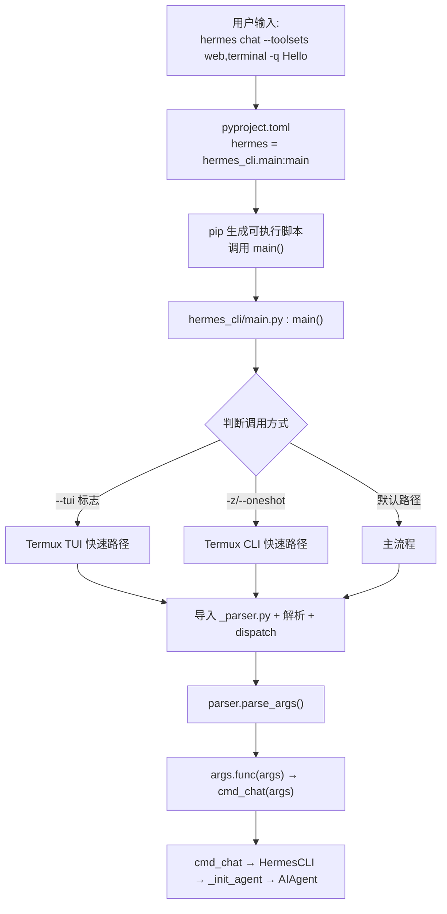
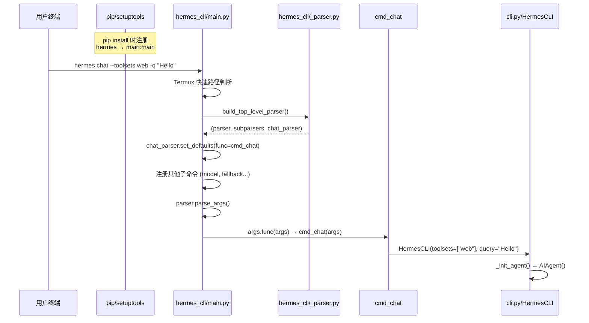
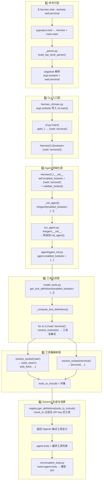

# Hermes 命令启动流程：入口解析与参数流转

> 讨论日期：2026-07-31  
> 源码版本：hermes-agent  
> 讨论主题：`hermes chat --toolsets "web,terminal"` 从敲下回车到模型 API 的完整链路

---

## 目录

- [第一部分：命令入口 → _parser.py](#第一部分命令入口--_parserpy)
- [第二部分：--toolsets 参数完整流转](#第二部分--toolsets-参数完整流转)
- [第三部分：关键设计决策](#第三部分关键设计决策)
- [第四部分：核心文件速查](#第四部分核心文件速查)

---

## 第一部分：命令入口 → _parser.py

### 1.1 总览流程图



### 1.2 时序图



### 1.3 pip 入口点

`pyproject.toml` 第 308 行声明了命令入口：

```toml
[project.scripts]
hermes = "hermes_cli.main:main"
```

pip install 时 setuptools 根据此声明生成 `hermes` 可执行脚本，等价于：

```python
from hermes_cli.main import main
main()
```

### 1.4 两阶段 dispatch 机制

`hermes_cli/main.py` 的 `main()` 函数采用两阶段 dispatch：

```
main()
  │
  ├── 阶段 1: 快速路径（Termux 优化）
  │   ├── _try_termux_fast_tui_launch()    # --tui 手机端快速启动
  │   └── _try_termux_fast_cli_launch()    # chat/oneshot 快速启动
  │       └── 只导入 _parser.py（轻量级，避免冷启动开销）
  │
  └── 阶段 2: 完整路径
      ├── 从 _parser.py 导入 build_top_level_parser
      ├── 构建顶层 parser + chat 子 parser
      ├── 导入并注册所有子命令模块（model/fallback/gateway/sessions/...）
      ├── parser.parse_args(sys.argv)
      └── args.func(args)  → 调用对应的 cmd_*()
```

**为什么需要快速路径？** Termux（Android 终端）上 `hermes --tui` 是最高频路径。如果每次都完整加载 model、fallback、gateway、migrate、kanban、plugins 等模块，冷启动会非常慢。快速路径只导入轻量的 `_parser.py` 即完成解析。

### 1.5 build_top_level_parser() — 三层 parser 结构

`hermes_cli/_parser.py:85` 返回三元组 `(parser, subparsers, chat_parser)`：

```
┌─────────────────────────────────────────────────────┐
│  parser (顶层 ArgumentParser, prog="hermes")         │
│                                                     │
│  全局标志（子命令前可用）:                             │
│    -V/--version       -z/--oneshot                   │
│    -t/--toolsets      -m/--model     --provider      │
│    -r/--resume        -c/--continue                  │
│    -w/--worktree      --tui/--cli                    │
│    -s/--skills        --yolo        --safe-mode      │
│    --ignore-user-config  --ignore-rules              │
│    --accept-hooks     --pass-session-id               │
│                                                     │
│  ┌─────────────────────────────────────────────┐    │
│  │  subparsers (dest="command")                 │    │
│  │                                              │    │
│  │  ┌──────────────────────────────────────┐   │    │
│  │  │  chat_parser  (由 _parser.py 构建)     │   │    │
│  │  │    -q/--query    --image              │   │    │
│  │  │    -t/--toolsets (SUPPRESS)           │   │    │
│  │  │    -m/--model    (SUPPRESS)           │   │    │
│  │  │    -v/--verbose  -Q/--quiet           │   │    │
│  │  │    --max-turns   --checkpoints         │   │    │
│  │  └──────────────────────────────────────┘   │    │
│  │                                              │    │
│  │  其他子 parser（在 main.py 中内联注册）:       │    │
│  │    model, fallback, gateway, sessions,       │    │
│  │    auth, setup, hooks, doctor, debug, ...    │    │
│  └─────────────────────────────────────────────┘    │
└─────────────────────────────────────────────────────┘
```

### 1.6 default=argparse.SUPPRESS 机制

chat 子 parser 中 `-t/--toolsets`、`-m/--model` 等使用 `default=argparse.SUPPRESS`：

```python
chat_parser.add_argument(
    "-t", "--toolsets",
    default=argparse.SUPPRESS,   # ← 不用 None！
)
```

**原因：** 当用户输入 `hermes -t web chat` 时：
1. 顶层 parser 先解析 → `args.toolsets = "web"`
2. chat 子 parser 再解析
3. 如果 chat parser 写 `default=None`，会**覆盖**顶层值
4. `argparse.SUPPRESS` 让子 parser 不设默认值，顶层值被保留

### 1.7 _inherited_flag() — relaunch 标记

`hermes_cli/_parser.py:26`：

```python
def _inherited_flag(parser, *args, **kwargs):
    """等价于 add_argument + 标记 flag 在 relaunch 时需携带"""
    action = parser.add_argument(*args, **kwargs)
    action.inherit_on_relaunch = True
    return action
```

当 Hermes 重新执行自身（如 `sessions browse` 选中会话后重入 chat、setup 完成启动 chat），`hermes_cli.relaunch` 通过 introspection 发现标记了 `inherit_on_relaunch=True` 的 flag 并重新传递。

### 1.8 为什么 _parser.py 独立存在？

1. **relaunch.py** — 需要检查 flag 但不希望导入整个 main.py
2. **console_engine.py** — 读取帮助文本用于自动补全
3. **Termux 快速路径** — 避开 model/fallback/gateway 等重模块

---

## 第二部分：--toolsets 参数完整流转

### 2.1 六阶段总览



### 2.2 第 1 步：CLI 参数解析

`hermes_cli/_parser.py` 在两个层级声明 `--toolsets`：

```python
# 顶层 parser（全局标志）
parser.add_argument(
    "-t", "--toolsets",
    default=None,
    help="Comma-separated toolsets to enable for this invocation.",
)

# chat 子 parser（default=SUPPRESS 防覆盖）
chat_parser.add_argument(
    "-t", "--toolsets",
    default=argparse.SUPPRESS,
    help="Comma-separated toolsets to enable",
)
```

### 2.3 第 2 步：字符串 → 列表 → HermesCLI

```python
# cli.py:15901-15937
toolsets_list = None
if toolsets:
    if isinstance(toolsets, str):
        toolsets_list = [t.strip() for t in toolsets.split(",")]
        # "web,terminal" → ["web", "terminal"]
    elif isinstance(toolsets, (list, tuple)):
        toolsets_list = []
        for t in toolsets:
            if isinstance(t, str):
                toolsets_list.extend([x.strip() for x in t.split(",")])
            else:
                toolsets_list.append(str(t))
else:
    # 无 --toolsets → 通过 coding_context 判断默认工具集
    from agent.coding_context import coding_selection
    _coding = coding_selection(platform="cli", config=CLI_CONFIG)
    ...

cli = HermesCLI(
    model=model,
    toolsets=toolsets_list,   # ["web", "terminal"]
    ...
)
```

### 2.4 第 3 步：HermesCLI 存储 & 校验

```python
# cli.py:3879-3890
self.enabled_toolsets = toolsets          # ["web", "terminal"]
self.disabled_toolsets = CLI_CONFIG["agent"].get("disabled_toolsets") or []

# 校验是否为已知工具集
if toolsets and "all" not in toolsets and "*" not in toolsets:
    mcp_names = set((CLI_CONFIG.get("mcp_servers") or {}).keys())
    invalid = [t for t in toolsets if not validate_toolset(t) and t not in mcp_names]
    if invalid:
        self._console_print(f"Warning: Unknown toolsets: {', '.join(invalid)}")
```

### 2.5 第 4 步：_init_agent → AIAgent → init_agent

```python
# hermes_cli/cli_agent_setup_mixin.py:343-355
self.agent = AIAgent(
    ...
    enabled_toolsets=self.enabled_toolsets,    # ["web", "terminal"]
    disabled_toolsets=self.disabled_toolsets,
    ...
)
```

```python
# run_agent.py:490-506 — AIAgent.__init__ 是纯转发
def __init__(self, ..., enabled_toolsets=None, disabled_toolsets=None, ...):
    from agent.agent_init import init_agent
    init_agent(self, ..., enabled_toolsets=enabled_toolsets, ...)
```

```python
# agent/agent_init.py:619-620 — 存储为 agent 属性
agent.enabled_toolsets = enabled_toolsets

# agent/agent_init.py:1189-1193 — 调用过滤引擎
agent.tools = _ra().get_tool_definitions(
    enabled_toolsets=enabled_toolsets,
    disabled_toolsets=disabled_toolsets,
    quiet_mode=agent.quiet_mode,
)

# agent/agent_init.py:1196-1198 — 记录有效工具名
agent.valid_tool_names = {tool["function"]["name"] for tool in agent.tools}
```

### 2.6 第 5 步：核心过滤引擎 `_compute_tool_definitions()`

`model_tools.py:357-445` — 整个流程最关键的一步：

```python
def _compute_tool_definitions(
    enabled_toolsets: Optional[List[str]] = None,
    disabled_toolsets: Optional[List[str]] = None,
    ...
) -> List[Dict[str, Any]]:

    tools_to_include: set = set()

    # ─── 启用逻辑 ───
    if enabled_toolsets is not None:
        effective = list(enabled_toolsets)
        # Kanban worker 自动追加 kanban 工具集
        if os.environ.get("HERMES_KANBAN_TASK") and "kanban" not in effective:
            effective.append("kanban")

        for toolset_name in effective:     # ["web", "terminal"]
            if validate_toolset(toolset_name):
                resolved = resolve_toolset(toolset_name)
                tools_to_include.update(resolved)
    else:
        # 未传 → 默认所有工具
        from toolsets import get_all_toolsets
        for ts_name in get_all_toolsets():
            tools_to_include.update(resolve_toolset(ts_name))

    # ─── 禁用逻辑（始终作为减法执行）───
    if disabled_toolsets:
        for toolset_name in disabled_toolsets:
            # hermes-* 平台 bundle 只移除非核心工具，防止误删共享核心
            if toolset_name.startswith("hermes-") or (
                get_toolset(toolset_name) or {}).get("posture"):
                to_remove = bundle_non_core_tools(toolset_name)
                tools_to_include.difference_update(to_remove)
            else:
                resolved = resolve_toolset(toolset_name)
                tools_to_include.difference_update(resolved)

    # ─── 注册表获取最终 schema ───
    filtered_tools = registry.get_definitions(tools_to_include, quiet=quiet_mode)
```

**缓存策略：** 当 `quiet_mode=True` 时，使用 memoization 缓存。缓存的 key 由以下组成：
- `frozenset(enabled_toolsets)` + `frozenset(disabled_toolsets)`
- `registry._generation`（注册表版本号）
- 配置文件 mtime + size
- `HERMES_KANBAN_TASK` 环境变量

### 2.7 第 6 步：`resolve_toolset()` 递归解析

`toolsets.py:687-766` — 递归展开工具集定义，处理 `includes` 组合关系和循环检测：

```python
def resolve_toolset(name: str, visited: Set[str] = None, *,
                    include_registry: bool = True) -> List[str]:
    # 特殊别名 "all" / "*" — 遍历所有工具集并展开
    if name in {"all", "*"}:
        all_tools = set()
        for toolset_name in get_toolset_names():
            resolved = resolve_toolset(toolset_name, visited.copy())
            all_tools.update(resolved)
        return sorted(all_tools)

    # 循环检测（钻石依赖/循环引用安全跳过）
    if name in visited:
        return []
    visited.add(name)

    # 获取工具集定义
    toolset = get_toolset(name)
    if not toolset:
        return []

    # 收集直接工具
    tools = set(toolset.get("tools", []))

    # 递归处理 includes → 组合关系
    for included_name in toolset.get("includes", []):
        included_tools = resolve_toolset(included_name, visited)
        tools.update(included_tools)

    return sorted(tools)
```

**解析示例：**

| 输入 | 过程 | 输出 |
|------|------|------|
| `"web"` | 直接解析 TOOLSETS["web"] | `["web_search", "web_fetch", "web_extract", "web_crawl", "web_readability_extract"]` |
| `"terminal"` | 直接解析 TOOLSETS["terminal"] | `["terminal"]` |
| `"research"` | includes=["web","vision"] → 递归 | web 的所有工具 + vision 的所有工具 |
| `"all"` / `"*"` | 遍历所有工具集名递归 | 全部工具 |

### 2.8 工具集定义结构

`toolsets.py:95-581` — `TOOLSETS` 字典的层级结构：

```
TOOLSETS
  ├── 基础工具集（独立 tools 列表）
  │   ├── web       → {web_search, web_fetch, web_extract, web_crawl, ...}
  │   ├── terminal  → {terminal}
  │   ├── vision    → {vision, vision_analyze, screenshot_capture, ...}
  │   ├── creative  → {...画布/写作工具...}
  │   └── reasoning → {...推理工具...}
  │
  ├── 组合工具集（通过 includes 组合基础工具集）
  │   ├── research      includes: [web, vision]
  │   ├── development   includes: [terminal, file_operations, code_generation]
  │   ├── analysis      includes: [reasoning, web, file_operations]
  │   ├── full_stack    includes: [web, terminal, vision, ...]
  │   └── ...
  │
  ├── 场景工具集（posture: True，无 --toolsets 时由 coding_context 自动选择）
  │   ├── coding        代码工作区默认
  │   ├── safe          无终端访问
  │   └── ...
  │
  └── 平台 bundle（hermes-* 前缀，核心工具 + 平台特有工具）
      ├── hermes-cli
      ├── hermes-telegram
      └── ...
```

### 2.9 最终消费

`agent/conversation_loop.py:968`：

```python
api_messages, tools=agent.tools or None
```

每次 API 调用时，过滤后的工具列表通过 `tools=` 参数传给模型。模型只能看到 `agent.tools` 中的工具 schema。

### 2.10 `chat()` 方法为什么不接受 toolsets 参数

`run_agent.py:5812-5824` — `AIAgent.chat()` 是简化接口：

```python
def chat(self, message: str, stream_callback=None) -> str:
    result = self.run_conversation(message, stream_callback=stream_callback)
    return result["final_response"]
```

工具集的过滤发生在 agent **初始化阶段**（`AIAgent.__init__()` → `init_agent()` → `get_tool_definitions()`），而非每次对话时。因此 `chat()` 不需要也不接受 toolsets 参数。

---

## 第三部分：关键设计决策

| 设计 | 位置 | 目的 |
|------|------|------|
| `_parser.py` 独立模块 | `hermes_cli/_parser.py` | relaunch/console_engine/Termux 快速路径轻量访问 parser |
| `build_top_level_parser()` 返回三元组 | `_parser.py:85` | 调用方拿到 parser + subparsers + chat_parser，可继续注册子命令 |
| `default=argparse.SUPPRESS` | `_parser.py:299` | 防止子 parser 覆盖顶层 parser 已解析的值 |
| `_inherited_flag()` | `_parser.py:26` | 标记 relaunch 需要携带的 flag |
| `set_defaults(func=cmd_chat)` | `main.py` | argparse 标准 dispatch 模式 |
| Termux 两阶段 dispatch | `main.py` | 手机端跳过重模块加载，只导 `_parser.py` 快速进入 |
| toolsets 过滤在 init 阶段完成 | `agent_init.py` | 工具集是会话级配置，非每次对话级 |
| quiet_mode 缓存 key | `model_tools.py:311` | Gateway 长期进程中的工具定义缓存，按 toolsets+registry gen+config mtime 分片 |
| `resolve_toolset()` 递归 includes | `toolsets.py:687` | 支持组合工具集（research=web+vision），钻石依赖安全 |
| `bundle_non_core_tools()` | `toolsets.py:659` | 禁用 hermes-* 平台 bundle 时只移除非核心工具 |

---

## 第四部分：核心文件速查

| 文件 | 关键行号 | 作用 |
|------|---------|------|
| `pyproject.toml` | 308 | `hermes` 命令入口点 → `hermes_cli.main:main` |
| `hermes_cli/_parser.py` | 85-428 | `build_top_level_parser()` — 构建顶层+chat parser |
| `hermes_cli/_parser.py` | 26 | `_inherited_flag()` — relaunch 标记 |
| `hermes_cli/main.py` | 12848-12851 | 主流程：调 `build_top_level_parser()` + 设 dispatch |
| `hermes_cli/main.py` | 12534-12608 | `_try_termux_fast_cli_launch()` — Termux 快速路径 |
| `hermes_cli/main.py` | 12611-12643 | `_try_termux_fast_tui_launch()` — TUI 快速路径 |
| `hermes_cli/main.py` | 2436 | args.toolsets 传入 cli.main() |
| `cli.py` | 15789-15937 | `cli.main()` — 解析 toolsets 字符串→列表 |
| `cli.py` | 3677-3940 | `HermesCLI.__init__()` — 存储并校验 toolsets |
| `cli.py` | 5812 | `AIAgent.chat()` — 简化接口（不涉及 toolsets） |
| `hermes_cli/cli_agent_setup_mixin.py` | 218-409 | `_init_agent()` → `AIAgent()` |
| `run_agent.py` | 416-532 | `AIAgent.__init__()` → 转发到 `init_agent()` |
| `agent/agent_init.py` | 619-620 | 存储 `agent.enabled_toolsets` / `disabled_toolsets` |
| `agent/agent_init.py` | 1189-1193 | 调用 `get_tool_definitions()` |
| `agent/agent_init.py` | 1924-1932 | context_engine 工具的条件注入 |
| `model_tools.py` | 279-354 | `get_tool_definitions()` — 缓存+委托 |
| `model_tools.py` | 357-567 | `_compute_tool_definitions()` — 核心过滤引擎 |
| `toolsets.py` | 95-581 | `TOOLSETS` 字典 — 所有工具集定义 |
| `toolsets.py` | 687-766 | `resolve_toolset()` — 递归解析引擎 |
| `toolsets.py` | 862-879 | `validate_toolset()` — 校验工具集名 |
| `toolsets.py` | 659-680 | `bundle_non_core_tools()` — 平台 bundle 减法 |
| `agent/conversation_loop.py` | 968 | 最终消费：`tools=agent.tools` 传给模型 |
